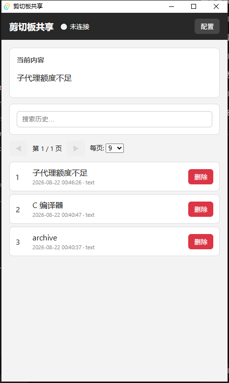
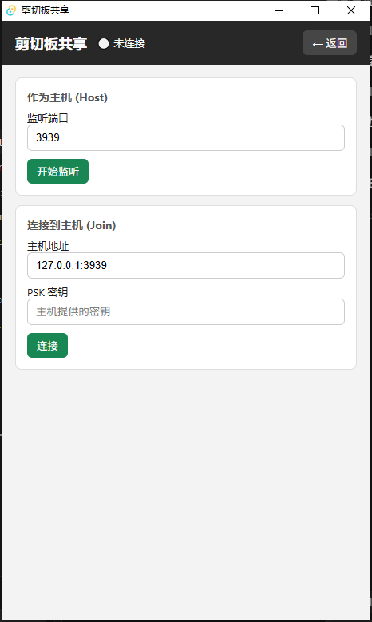

# Clipboard Share Client

跨 macOS / Windows / Linux 的局域网剪贴板共享客户端。两台电脑建立加密连接后，可同步文字与图片；本机同时保留可搜索的剪贴板历史，并用快捷键快速取用。

## 界面预览

### 历史列表

当前剪贴板预览、搜索、分页，以及按条目应用 / 删除。



### 连接配置

一端作为 Host 监听，另一端 Join 并填入 PSK 即可配对。



## 功能介绍

### 局域网 P2P 同步

- **Host / Join 双角色**：一台设备监听端口（默认 `3939`），另一台填入 `IP:端口` 与密钥连接
- **Noise 加密通道**：主机启动后生成 PSK，对端凭同一密钥完成握手，避免局域网误连
- **载荷类型**：纯文本与图片（协议层亦保留 HTML 能力）
- **状态可见**：顶栏实时显示未连接 / 已连接等状态

### 本机剪贴板历史

- 记录近期剪贴板条目，SQLite 持久化（约 `~/.clipboard_share/`）
- **搜索**：按预览内容即时过滤
- **分页**：每页 9 / 15 / 30 条可调
- **一点即用**：点击条目写入本机剪贴板（不会因此再推送给对端）
- **删除**：单条清除，保持列表干净

### 快捷键

| 快捷键 | 作用 |
|--------|------|
| `Ctrl+Shift+V` | 显示 / 隐藏主窗口 |
| `Ctrl+Shift+1` … `9` | 将历史第 1～9 条写入本机剪贴板 |
| `↑` / `↓` | 列表内移动选中项 |
| `Enter` | 应用当前选中项 |
| `1` … `9`（窗口内） | 快选当前页对应条目 |
| `PageUp` / `PageDown` | 上一页 / 下一页 |

## 技术栈

| 层 | 技术 |
|----|------|
| 桌面壳 | [Tauri 2](https://tauri.app/) |
| 前端 | Vue 3 + Vite + TypeScript（`ui/`） |
| 后端 | Rust：`arboard` 剪贴板、`rusqlite` 历史、`snow` Noise P2P、`tauri-plugin-global-shortcut` |

## 快速开始

### 环境要求

- [Rust](https://rustup.rs/)（stable）
- [Node.js](https://nodejs.org/)（建议 LTS）
- Windows：需安装 [WebView2](https://developer.microsoft.com/microsoft-edge/webview2/)；建议使用 MSVC 工具链（见下文）

### 开发运行

```bash
npm install
npm run tauri dev
```

### 生产构建

```bash
npm run tauri build
```

产物位于 `src-tauri/target/release/`（及对应安装包目录）。

### 检查与测试

```bash
cd src-tauri && cargo check
cd src-tauri && cargo test
npm run build
```

## Windows 构建说明

推荐安装 [VS Build Tools](https://visualstudio.microsoft.com/visual-cpp-build-tools/)（含「使用 C++ 的桌面开发」），然后：

```bash
rustup default stable-x86_64-pc-windows-msvc
```

若暂时只能用 `windows-gnu`，`src-tauri/build.rs` 已加入 `--exclude-all-symbols` 以规避 `export ordinal too large`；测试二进制仍可能因 DLL 问题无法运行，优先切回 MSVC。

## 使用流程（两机同步）

1. 在设备 A 打开 **配置 → 作为主机**，点击「开始监听」，将生成的 **PSK** 发给设备 B  
2. 在设备 B 打开 **配置 → 连接到主机**，填入 A 的局域网地址（如 `192.168.1.10:3939`）与同一 PSK，点击「连接」  
3. 顶栏变为已连接后，任一方复制内容会写入本机历史，并自动同步到对端；历史里点击条目可写回本机剪贴板（不会再次推送） 

## 项目结构

```
clipboard-share-client/
├── ui/                 # Vue3 前端
├── src-tauri/          # Tauri + Rust 后端
├── docs/images/        # README 截图
├── openspec/           # 规格与变更历史
└── package.json
```

## 规格与贡献

行为契约与变更记录以 `openspec/` 为准；面向 agent 的仓库约定见 [`AGENTS.md`](AGENTS.md)。
